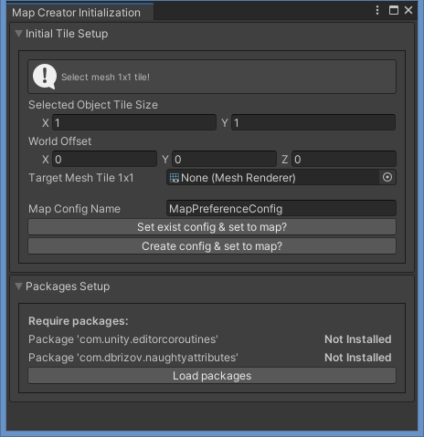
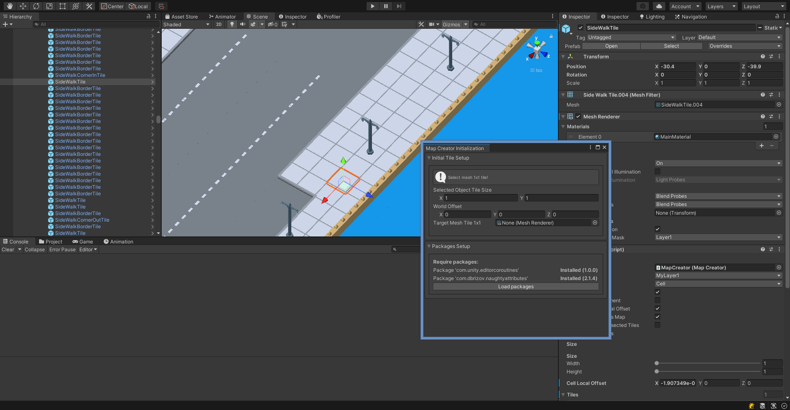
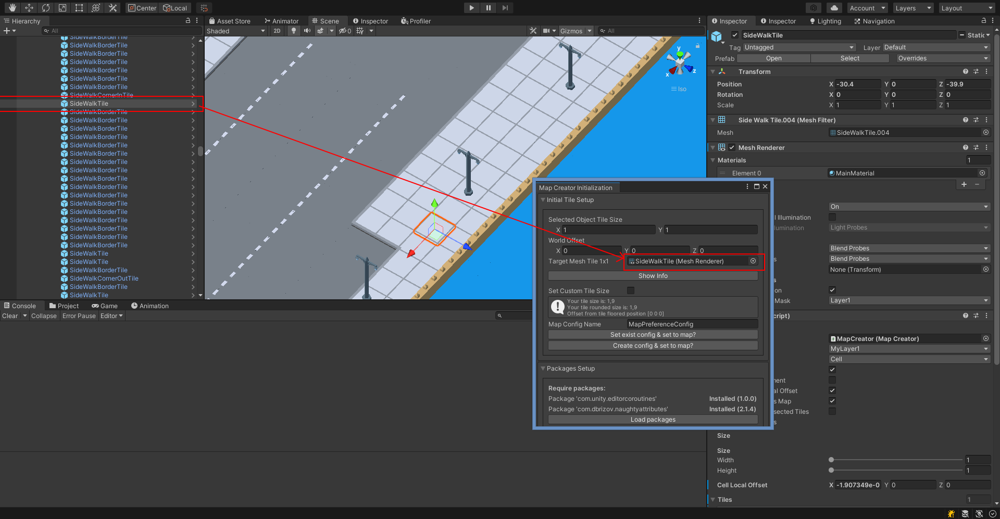

Getting started
=====

.. _installation:

Installation
------------

To use Tile Prefab Placer steps:

#. Download & import from unity asset store
#. Initilization window will be open automatically first time or you can open it manually in toolbar 
``604Spirit/MapEditor/Window/Map Creator Initialization``

#. Click `Load Packages` to start downloading required packages for this tool

.. note::
	**Required packages:**
	* Editor coroutine (`com.unity.editorcoroutines`) - unity package allows developers to start constructs similar to Unity’s monobehaviour based coroutines within the editor using abitrary objects.
	* Naughty Atrributes (`com.dbrizov.naughtyattributes`) - made by Denis Rizov extension for unity inspector, 
	also you can manually download it from unity asset store `Naughty Atrributes <https://assetstore.unity.com/packages/tools/utilities/naughtyattributes-129996>`

#. Select tile 1x1 size to customize tile size of the tool

	* Move the 1x1 size of the tile into the field & press show info button

	* Press click set exist config to assign the tile size to the tool

**The tool is now ready for use**