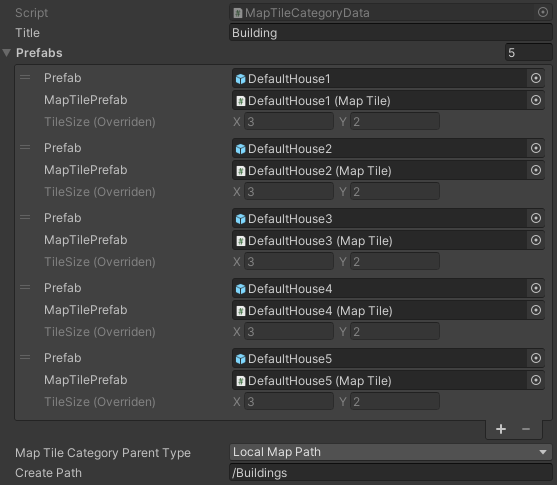

Getting started
************

.. _installation:

Installation
============

**To use Tile Prefab Placer steps:**

#. Download & import from unity asset store.

#. First time initilization window will appear automatically or you can open it manually in toolbar ``604Spirit/MapEditor/Window/Map Creator Initialization.``

#. Click `Load Packages` to start downloading required packages for this tool.

	.. image:: images/gettingstarted/InitilizationWindow.png


	.. note::
		**Required packages:**
		
		* **Editor coroutines** (`com.unity.editorcoroutines`) - unity package allows developers to start constructs similar to Unity’s monobehaviour based coroutines within the editor using arbitrary objects.
		
		* **Naughty Atrributes** (`com.dbrizov.naughtyattributes`) - made by Denis Rizov extension for unity inspector, also you can manually download it from unity asset store `Naughty Attributes <https://assetstore.unity.com/packages/tools/utilities/naughtyattributes-129996>`_


	.. note::
		**Required project script defines:**
			* **MAP_EDITOR**

#. Select tile 1x1 size to customize tile size of the tool.

		.. image:: images/gettingstarted/TileInitilization.png
		
	|
	* Move the 1x1 size of the tile into the field & press `show info` button.
		.. image:: images/gettingstarted/TileInitilization2.png

	* Press `set exist config` to assign the tile size to the tool.
	
#. Set the tile path in the `MapCreator`'s cached settings tab where the prefab categories are stored.

	.. image:: images/gettingstarted/CachedValuesTabPrefabPath.png


.. _prefabs:Ctrl & scroll wheel button


Prefabs
=======

```MapCreator` scroll view consists of prefab categories.``

**Category** - it's a prefab set, create categories according to your needs.

**How to create categories:**
-----------------------------

	.. image:: images/gettingstarted/AddCategory1.png

* Click `+` button to start adding category.
* Enter category name.
* Click `add` button.

	.. note::
		To delete a category, select category and click the `-` button.

**How to add prefabs:**
-----------------------

	* Drag & drop desirable prefabs to drop tab.	
		.. image:: images/gettingstarted/AddingPrefabs1.png


	* Prefabs are ready to use.
		.. image:: images/gettingstarted/AddingPrefabs2.png

	.. note::
		`MapTile` component is used for the calculation of intersections on the grid, so if you don't need it you can use default game objects.


.. _category:

Category
========



* **Title** : name of category.
* **Prefab data:**
	* **Prefab** : reference to the prefab gameobject.
	* **MapTilePrefab** : reference to the `MapTile` prefab.
	* **TileSize** : object size in grid cells (you can set the size manually if the prefab is without a `MapTile` component).
* **MapTile category parent type:** 
	* **Local map path** : object is created relative to the path of the `MapCreator` layer.
	* **Scene path** : object is created relative to the path of the scene root.
* **Scene path** : object creation path.


.. _configs:

Configs
=======

**Cached Values Settings**
--------------------------

	.. image:: images/gettingstarted/CachedValuesTab.png

* **Root** : root for `MapCreator`'s stuff.
* **Default Game Objects Root** : root for created default game objects (without `MapTile` component).
* **Tile Path** : the path in the project where the categories are located.
* **Tileset Path** : the path in the project where the tilesets are located.
* **Map Preference Config** : :ref:`Map Preference Config` scriptable object.
* **Map Config** : `MapCreator` config scriptable object.
* **Hotkey Config** : :ref:`hotkey config<Common hotkey config>` scriptable object.
* **Map Creator Tab View** : internal map creator tabs view.
* **Map Data Holder** : :ref:`map layer data<Map Holder Settings>`.


.. _mapHolder:

**Map Holder Settings**
-----------------------

	.. image:: images/gettingstarted/MapHolderTab.png
	
Here are references to the maps and the name of the layers.


**Map Preference Config**
-------------------------

	.. image:: images/gettingstarted/MapPreferenceWindow.png
	
* Common Settings
	* **Tile Size** : default tile size of `MapCreator`.
	* **World Tile Relative Offset** : world offset relative to the floored cell position.
	
* Tool Settings
	* **Show Scene Tool Panel** : displays `M` UI button on the scene view.
	* **Tool Bar Max Count** : the number of category buttons in one row of the toolbar.
	* **Tile Button Size** : the size of the prefab button in the `MapCreator` prefab scroll view.
	* **Has Remove Buttons** : enable buttons to remove prefabs from categories in `MapCreator` prefab scroll view.
	* **Remove Button Size** : size of remove button.
	* **Buttons Row Count** : the number of prefab buttons in the scroll view in one row.
	* **Prefab Scroll View Height** : height of scroll view of `MapCreator`.
	
* Temp Mesh Settings
	* **Default Draw Mesh Type** : object view type for temp meshes.
		* **Draw Mesh** : display the temp mesh object at the end of a render pipeline cycle.
		* **Draw Mesh Now** : the display of the temp mesh object at the moment.
	* **Apply Allow Color To Objects** : enable custom allow color for the objects that can be placed.
	* **Allow Mesh Grid Color** : color of mesh grid when object can be placed.
	* **Allow Object Color** : color for the object that can be placed.
	* **Forbidden Mesh Grid Color** : color for the object that can't be placed.
	* **Intersection Mesh Grid Color** : color for the object that intersected.

**Common Settings**
-------------------

	.. image:: images/gettingstarted/CommonSettingsTab.png

* **Show Map Tile Bounds** : display the mesh grid of the object.
* **Draw Grid** : display scene view grid.
* **Always Visible Grid** : the grid will always be displayed regardless of the overlap with other objects.
* **Grid Size** : size of scene view grid.
* **Grid Color** : color of scene view grid.
* **Async Creation** : async instantiation for the objects.
	* **Create Objects Per Frame** : the number of instantiated objects per frame.
* **Create Prefab Mode:**
	* **Linked prefab** : created object will be linked with source prefab.
	* **Prefab clone** : created object will be cloned from source prefab.
* **Key Rotate Angle** : the angle of rotation of the object by button (by default `capslock` button).
* **Show Edit Category Buttons** : show add/remove buttons for category in `MapCreator` inspector.
* **Show Map Tile Selected Info Tab** : show `MapTile selected info` tab.
* **Show Add New Prefab Tab** : show drag'n'drop prefab box in `MapCreator` inspector.

Hotkeys
=======

**Common hotkey config**
------------------------

	.. image:: images/gettingstarted/HotKeyConfig.png
	
* **Rotate button** : rotate button of the object.
* **Switch sub prefab button** : rerandomize TRS (transform, rotation, scale) or selected objects (if randomize feature enabled and configured).
* **Action button** : action of the `MapCreator` edit mode (for example object spawning).
* **Unselect prefab button** : cancel action or unselect selected temp prefab.
* **Select default edit mode button** : select default edit mode hotkey.
* **Select brush mode button** : select brush mode hotkey.
* **Select line mode button** : select line mode hotkey.
* **Select area mode button** : select area mode hotkey.
* **Select destroy mode button** : select destroy mode hotkey.
* **Select tileset mode button** : select tileset mode hotkey.
* **Select translate mode button** : select translate mode hotkey.
* **Select template mode button** : select template mode hotkey.
* **Scroll wheel button** : additional action with scroll wheel button in the edit modes.

**Custom hotkey settings**
--------------------------

	* **Single mode:**
		* `Ctrl & scroll wheel button` : increasing and decreasing the scale of the object.
	* **Line mode:**
		* **Default:**
			* `Ctrl & scroll wheel button` : increase number of the floors (multi-floor support should be enabled).
		* **Curved:**
			* **Simple line:**
				* `Ctrl & left-mouse click` : add a new segment of the line.
	* **Area mode:**
		* **Default:**
			* `Ctrl & scroll wheel button` : increase number of the floors (multi-floor support should be enabled).
	* **Destroy mode:**
		* **Selection mode:**
			* `Space` : deleting selected objects using the selection box.


