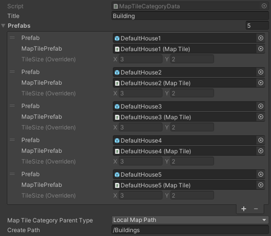

.. _mapCreator:

Map Creator
************

.. contents::
   :local:
      
Description
=======

Is a tool for placing tile objects on a grid, and can also be used to place default objects using a variety of custom :ref:`settings <tabs>` and :ref:`tools <modes>`.

.. _mapCreatorHowToCreate:
	  
How To Create
=======

In the `Unity` toolbar, select:

	`Spirit604/MapEditor/Create/Map Editor`
	
	.. image:: images/mapcreator/HowToCreate.png
	
Structure
=======

	.. image:: images/mapcreator/MapCreatorComponent.png
	
#. :ref:`Cached values. <cachedValues>`
#. :ref:`Common settings. <commonSettings>`
#. :ref:`Modes. <modes>`
#. :ref:`Tabs. <tabs>`
#. :ref:`Layer. <mapCreatorLayer>`
#. :ref:`Selected info. <mapCreatorSelectedInfo>`
#. :ref:`Categories. <category>`
#. :ref:`Prefabs. <prefabs>`

.. _prefabs:

Prefabs
=======

``MapCreator's scroll view consists of prefab categories.``

**Category** - it's a :ref:`prefab set <category>`, create categories according to your needs.

How To Create Category
-----------------------------

	.. image:: images/gettingstarted/AddCategory1.png

* Click ``+`` button to start adding category.
* Enter category name.
* Click ``Add`` button.

	.. note::
		To delete a category, select category and click the ``-`` button.

How To Add Prefab
-----------------------

	* Drag & drop desirable prefabs to drop tab.	
		.. image:: images/gettingstarted/AddingPrefabs1.png

	* Prefabs are ready to use.
		.. image:: images/gettingstarted/AddingPrefabs2.png

	.. note::
		:ref:`MapTile <maptile>` component is used in order to calculate intersections of objects on the grid without colliders, so if you don't need it, you can use default game objects.

.. _category:

Category
========

| **Title** : name of category.

**Prefab data:**
	* **Prefab** : reference to the prefab gameobject.
	* **MapTilePrefab** : reference to the :ref:`MapTile <maptile>` prefab.
	* **TileSize** : object size in grid cells (you can set the size manually if the prefab doesn't have a :ref:`MapTile <maptile>` component).
	
**MapTile category parent type:** 
	* **Local map path** : object is created relative to the path of the `MapCreator` layer.
	* **Scene path** : object is created relative to the path of the scene root.
	
| **Scene path** : object creation path.

.. _mapCreatorLayer:

Layer
========

``MapCreator layers is used to configure the display, selection, removal of objects of the selected layer in the scene and display in the inspector, depending on the selected edit mode.``

	.. image:: images/maptile/LayerSettings1.png
	* **Show all layers [if disabled]:`**
		* **Selected `MapTile` layer**
		* **Disable other object layers** : turn off objects in the scene with the improper layer.
	
	|
	
	Adjust the layers for displaying objects in the inspector according to their layer.
	
	.. image:: images/maptile/LayerSettings2.png
	
	.. image:: images/maptile/LayerSettings3.png
	
	|
	.. image:: images/maptile/LayerSettings4.png	
	`Show only Layer1 objects example.`
	
	|
	.. image:: images/maptile/LayerSettings5.png
	`Show only Layer2 objects example.`
	
	|
	.. image:: images/maptile/LayerSettings6.png
	`Show only Overlay objects example.`
	
.. _mapCreatorSelectedInfo:

Selected Info
========

Information about the last selected prefab.

	.. image:: images/mapcreator/MapTileSelectedInfo.png
	
| **Last selected** : name of the last prefab selected.
| **MapTile layer** : MapTile :ref:`layer <maptileLayer>`.
| **Size** : tile size of the :ref:`MapTile <maptile>`.

.. _configs:

Configs
=======

.. _cachedValues:

Cached Values Settings
--------------------------

	.. image:: images/gettingstarted/CachedValuesTab.png

| **Root** : root for `MapCreator`'s stuff.
| **Default Game Objects Root** : root for created default game objects (without :ref:`MapTile <maptile>` component).
| **Tile Path** : the path in the project where the categories are located.
| **Tileset Path** : the path in the project where the tilesets are located.
| **Map Preference Config** : :ref:`Map Preference Config` scriptable object.
| **Map Config** : `MapCreator` config scriptable object.
| **Hotkey Config** : :ref:`hotkey config <Common hotkey config>` scriptable object.
| **Map Creator Tab View** : internal `MapCreator's` tabs view.
| **Map Data Holder** : :ref:`map layer data <Map Data Holder Settings>`.

.. _mapHolder:

Map Data Holder Settings
-----------------------

	.. image:: images/gettingstarted/MapHolderTab.png
	
Here are references to the maps and the names of the layers.

Map Preference Config
-------------------------

	.. image:: images/gettingstarted/MapPreferenceWindow.png
	
Common Settings
~~~~~~~~~~~~

| **Tile Size** : default tile size of `MapCreator`.
| **World Tile Relative Offset** : world offset relative to the rounded cell position.
	
Tool Settings
~~~~~~~~~~~~

| **Show Scene Tool Panel** : displays ``M`` (select `MapCreator`) UI button on the scene view.
| **Tool Bar Max Count** : the number of category buttons in one row of the toolbar.
| **Tile Button Size** : the size of the prefab button in `MapCreator's` prefab scroll view.
| **Has Remove Buttons** : enable buttons to remove prefabs from categories in `MapCreator's` prefab scroll view.
| **Remove Button Size** : size of remove button.
| **Buttons Row Count** : the number of prefab buttons in the scroll view in one row.
| **Prefab Scroll View Height** : height of scroll view of `MapCreator`.
	
Temp Mesh Settings
~~~~~~~~~~~~

**Default Draw Mesh Type** : object view type for temporary meshes.
	* **Draw Mesh** : display the temporary mesh object at the end of a render pipeline cycle.
	* **Draw Mesh Now** : the display of the temporary mesh object at the moment.
	
| **Apply Allow Color To Objects** : enable custom allow colour for the objects that can be placed.
| **Allow Mesh Grid Color** : colour of the mesh grid when the object can be placed.
| **Allow Object Color** : colour of the object that can be placed.
| **Forbidden Mesh Grid Color** : colour of the object that can't be placed.
| **Intersection Mesh Grid Color** : colour of the object that intersects another object.
	
* Temp Overlay Mesh Grid Settings
	* **Mesh Surface Offset** : offset from surface to mesh grid (object visual bounds).

.. _commonSettings:

Common Settings
-------------------

	.. image:: images/gettingstarted/CommonSettingsTab.png

| **Show Map Tile Bounds** : display the mesh grid of the object (object visual bounds).
| **Draw Grid** : display scene view grid.
| **Always Visible Grid** : the scene view grid is always displayed, regardless of the overlap with other objects.
| **Grid Size** : size of the grid in the scene view.
| **Grid Color** : colour of scene view grid.

**Async Creation** : async instantiation of the objects.
	* **Create Objects Per Frame** : the number of instantiated objects per frame.
	
**Create Prefab Mode:**
	* **Linked prefab** : created object will be linked with source prefab.
	* **Prefab clone** : created object will be cloned from source prefab.
	
| **Key Rotate Angle** : the angle of rotation of the object by pressing the key (by default `Capslock` key).
| **Show Edit Category Buttons** : show add/remove buttons for category in the `MapCreator` inspector.
| **Show Map Tile Selected Info Tab** : show `MapTile selected info` tab.
| **Show Add New Prefab Tab** : show drag'n'drop prefab box in the `MapCreator` inspector.

.. _hotKeys:

Hotkeys
=======

Common Hotkey Config
------------------------

	.. image:: images/gettingstarted/HotKeyConfig.png
	
| **Rotate button** : rotate button of the object.
| **Switch sub prefab button** : re-randomize TRS (transform, rotation, scale) or selected objects (if randomize feature is enabled and configured).
| **Action button** : action of the `MapCreator` `edit mode` (for example object spawning).
| **Unselect prefab button** : cancel action or unselect selected temporary prefab.
| **Select default edit mode button** : select :ref:`default <singleMode>` edit mode hotkey.
| **Select brush mode button** : select :ref:`brush <brushMode>` mode hotkey.
| **Select line mode button** : select :ref:`line <lineMode>` mode hotkey.
| **Select area mode button** : select :ref:`area <areaMode>` mode hotkey.
| **Select destroy mode button** : select :ref:`destroy <destroyMode>` mode hotkey.
| **Select tileset mode button** : select :ref:`tileset <tilesetMode>` mode hotkey.
| **Select translate mode button** : select :ref:`translate <translateMode>` mode hotkey.
| **Select template mode button** : select :ref:`template <templateMode>` mode hotkey.
| **Scroll wheel button** : additional action in the `edit mode` using the mouse wheel and the selected key.

.. _customHotKeys:

Custom Hotkey Settings
--------------------------

	* **Single mode:**
		* `Ctrl & scroll wheel button` : increasing and decreasing the scale of the object.
	* **Line mode:**
		* **Default:**
			* `Ctrl & scroll wheel button` : increase number of the floors (multi-floor support should be enabled).
		* **Curved:**
			* **Simple line:**
				* `Ctrl & left-mouse click` : add a new segment of the line.
	* **Area mode:**
		* **Default:**
			* `Ctrl & scroll wheel button` : increase number of the floors (multi-floor support should be enabled).
	* **Destroy mode:**
		* **Selection mode:**
			* `Space` : deleting selected objects using the selection box.

