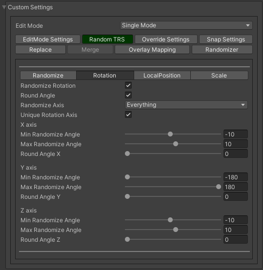
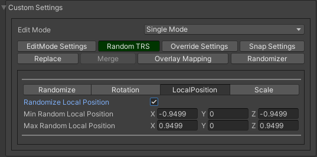
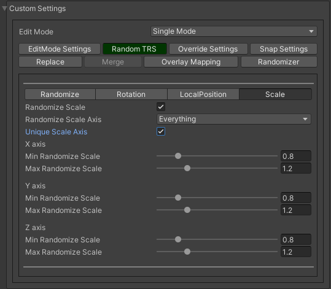
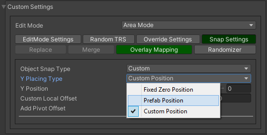
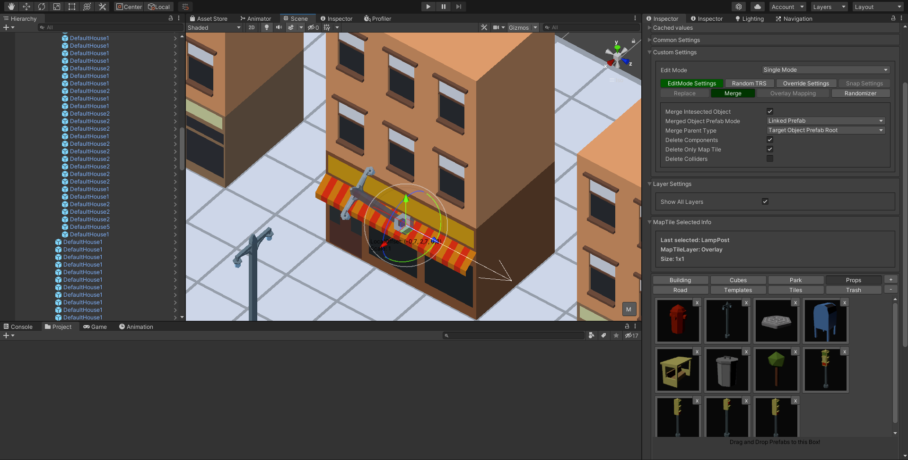
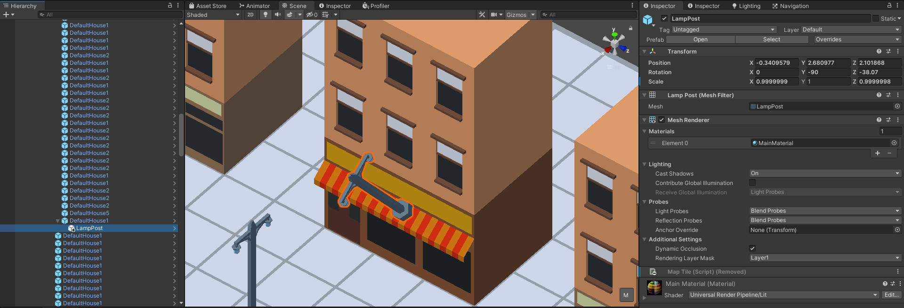
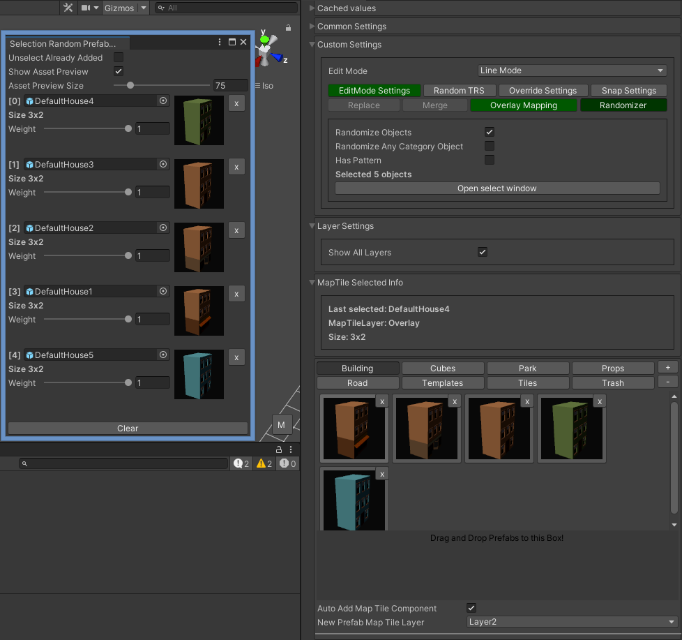
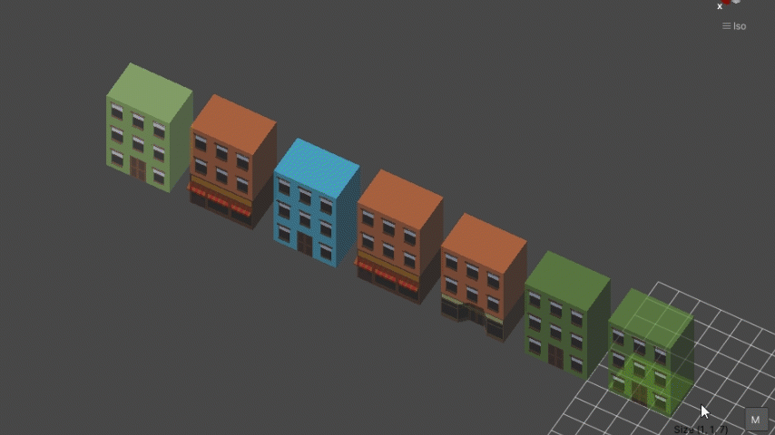
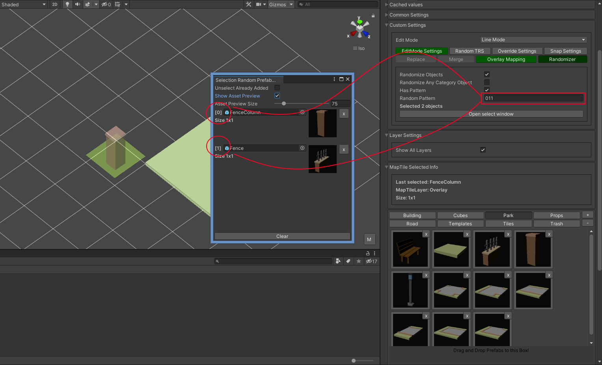
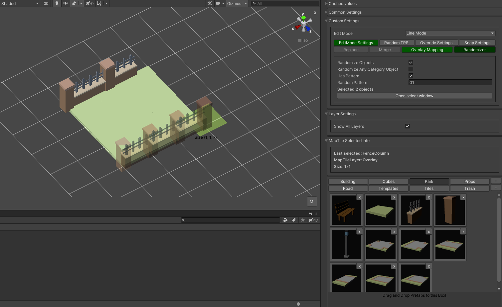

Common tabs Overview
=====

.. _installation:

EditMode settings
------------

**There are the following modes:**
	* Single mode
	* Brush mode
	* Line mode
	* Area mode
	* Destroy mode
	* Tileset area
	* Translate mode
	* Create template mode
	
Each mode contains unique settings, that described in more detail here :ref:`modes`

Random TRS
------------

Random TRS tab is used for randomization position, rotation or scale of the object

In this tab you can see what random is enabled

.. image:: images/tabs/RandomTab/RandomTab1.png

Сhoose which angle and axis of rotation to randomize 

Enter randomize local position relative spawn position

Enter value and axis of scale to randomize 

Override settings
------------

In the override settings tab you can override parent object, MapTile layer for non-overlay objects, and override unity layer

	.. image:: images/tabs/OverrideTab/OverrideTab1.png

	* **Override object parent** - choose a custom parent for the override
	* **Override MapTile layer** - choose a custom MapTile layer for MapTile objects
	* **Override Unity layer** - choose a custom Unity layer for the objects (Default, TransparentFX, Ignore Raycast, Water, UI, etc...)

	.. image:: images/tabs/OverrideTab/OverrideTab2.png

	.. note::
		For overlay MapTile objects or default game objects you can't override MapTile layer

Snap settings
------------

In snap settings you can adjust the y-axis snap settings

.. image:: images/tabs/SnapTab/SnapTab1.png

Object snap type:
	* Auto snap
	* Custom
	
**Auto snap**

.. image:: images/tabs/SnapTab/SnapTab2.png

Objects are automatically attached to the surface depending on the parameters

	* **Attach to mesh**
	
	The object is attached to the mesh, instead of the collider
	
	* **Attach same floor**
	
	Only works for area and line modes
	
	.. image:: images/tabs/SnapTab/SnapTab3.png
	
	To auto-snap objects on the same height use the attach same floor
	
	.. image:: images/tabs/SnapTab/SnapTab4.png
	
	* **Snap layer mask**
	
	Layer that the object is automatically attached
	
	* **Custom floor offset**
	
	Additional offsets to the surface
	
	* **Add pivot offset**
	
	.. image:: images/tabs/SnapTab/SnapTab5.png
	
Some tile objects may have a pivot in the center of the object
	
	.. image:: images/tabs/SnapTab/SnapTab6.png
	
To fix this, turn on add pivot offset

**Custom**

Customization value of the position on the Y axis

	* **Fixed zero position**
	
	Object is always positioned at Y zero position
	
	* **Prefab position**
	
	Object Y position is taken from the prefab position
	
	* **Custom position**
	
	.. image:: images/tabs/SnapTab/SnapTab8.png
	
	Set desired Y position of the object

Replace
------------

.. image:: images/tabs/ReplaceTab/ReplaceTab1.png

The object cannot be placed

.. image:: images/tabs/ReplaceTab/ReplaceTab2.png

Enable replace to replace intersected objects

.. image:: images/tabs/ReplaceTab/ReplaceTab3.png

	* Replace layer type
	
		.. image:: images/tabs/ReplaceTab/ReplaceTab4.png
	
		* **Object layer**
		Replace objects only on the same object layer
		
		.. image:: images/tabs/ReplaceTab/ReplaceTab5.png
		
		* **Custom layers**
			* **Replace map tile layer**
			Replace objects only on the selected layers
			* **Include object layer**

Merge
------------

	.. image:: images/tabs/MergeTab/MergeTab1.png

Merge is used to create object by a child to an existing one
 
	.. image:: images/tabs/MergeTab/MergeTab2.png
	
	* Merge object prefab mode
		* Linked prefab
		The created object is a linked prefab
		
		* Prefab clone
		The created object is a prefab clone
		
	.. image:: images/tabs/MergeTab/MergeTab3.png
	
	* Merge parent type
		* Target object prefab root
		The created object is created by a child to the prefab root
		
		* Target object parent of hit
		The created object is created by a child to the attached object
			
		* Custom parent		
		User selected custom parent
		
		* Relative prefab root path
		The created object is created by a child to the prefab root relative prefab root path
		
	* Delete components
		Delete all unity-components of the object
		* Delete only map tile 
			or only MapTile component
			
	* Delete colliders	
	Delete colliders of created object
	

For example, use the brush to attach the object to desired object

And create it

Overlay mapping
------------
 
 Overlay mapping is used for objects that do not need a grid
 
.. image:: images/tabs/OverlayTab/OverlayTab1.png

You can enable it for map tile layer 1-9

.. image:: images/tabs/OverlayTab/OverlayTab2.png

For overlay MapTile objects and non-MapTile object overlay mapping enabled by default

.. image:: images/tabs/OverlayTab/OverlayTab3.png

**Movement type:**
	* **Free moving**
	Object attached to cursor
	
	* **Default cell**
	Object snapping to default cell size
	
	.. image:: images/tabs/OverlayTab/OverlayTab4.png
	* **Custom cell**
	Object snapping to custom cell size
	
	.. image:: images/tabs/OverlayTab/OverlayTab5.png
	.. image:: images/tabs/OverlayTab/OverlayTab6.png
	* **Snap edge**
	Object snapping to edges of default cell
	
	.. image:: images/tabs/OverlayTab/OverlayTab7.png

	
**Obstacle check type:**
	* **Distance**
	
	.. image:: images/tabs/OverlayTab/ObstacleDistanceAnim.gif
	Object intersections are checked by distance
		
	* **Raycast**
	.. image:: images/tabs/OverlayTab/ObstacleRaycastAnim.gif
	Object intersections are checked by raycasts

Randomizer
------------

	.. image:: images/tabs/RandomizerTab/RandomizerTab1.png
	
Enable randomize objects to randomize every object creation
	* **Randomize any category object**
	Any object of selected category involved in randomization

Or select custom objects to randomize
	

Enter random pattern according to the indices of the selected objects

	
And place the objects