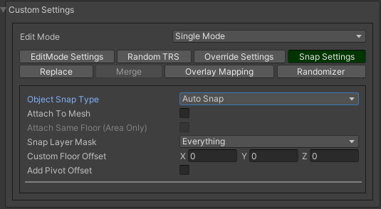

.. _tabs:

********************
Common tabs overview
********************

.. contents::
   :local:
   
EditMode settings
=================
   
**There are the following modes:**
	* Single mode
	* Brush mode
	* Line mode
	* Area mode
	* Destroy mode
	* Tileset area
	* Translate mode
	* Create template mode
	
Each mode contains unique settings, that described in more detail here :ref:`modes`.

Random TRS
==========

``Random TRS tab is used for randomization position, rotation or scale of the object.``

**Main randomize tab shows which random is enabled**

.. image:: images/tabs/RandomTab/RandomTab1.png

* Select which angle and axis of rotation to randomize.
	.. image:: images/tabs/RandomTab/RandomTab2.png
	
* Enter randomize local position relative to spawn position.
	.. image:: images/tabs/RandomTab/RandomTab3.png

* Enter value and axis of scale to randomize.
	.. image:: images/tabs/RandomTab/RandomTab4.png

Override Settings
=================

``In the override settings tab you can override parent object, :ref:`MapTile <maptile>` layer for non-overlay objects, and override unity layer.``

	.. image:: images/tabs/OverrideTab/OverrideTab1.png

	* **Override object parent** : a custom parent for the override.
	* **Override MapTile layer** : a custom :ref:`MapTile layer <maptileLayer>` for the :ref:`MapTile <maptile>` objects.
	* **Override Unity layer** : a custom `Unity layer <https://docs.unity3d.com/Manual/Layers.html>`_ for the objects (Default, TransparentFX, Ignore Raycast, Water, UI, etc...).

	.. image:: images/tabs/OverrideTab/OverrideTab2.png

	.. note::
		For :ref:`overlay <overlayTab> `MapTile` objects or default game objects (without :ref:`MapTile <maptile>` component) you can't override :ref:`MapTile layer <maptileLayer>`.

Snap Settings
=============

``In snap settings you can adjust the Y-axis object snap settings.``

.. image:: images/tabs/SnapTab/SnapTab1.png

Object Snap Type
-------------------	

Auto Snap
~~~~~~~~~~~~
	
Objects are automatically attached to the surface, depending on the parameters.

| **Attach to mesh** : the object is attached to the mesh, instead of the collider.
| **Attach same floor** : to auto-snap objects at the same height, use the `Attach same floor`.
	
	.. image:: images/tabs/SnapTab/SnapTab3.png		
		:width: 49 %			
	
	.. image:: images/tabs/SnapTab/SnapTab4.png
		:width: 49 %				
	`Attach same floor example.`
			
	.. note::
		Only works for :ref:`Area <areaMode>` and :ref:`Line <lineMode>` modes.

| **Snap layer mask** : `unity layer <https://docs.unity3d.com/Manual/Layers.html>`_ that the object is automatically attached.
| **Custom floor offset** : additional offset to the surface.
| **Add pivot offset** : adds a pivot offset of the object regarding to the surface.

	.. image:: images/tabs/SnapTab/SnapTab5.png		
	Some tile objects may have a pivot point in the centre of the object.

	.. image:: images/tabs/SnapTab/SnapTab6.png		
	To fix this, turn on `Add pivot offset`.

Custom
~~~~~~~~~~~~

Customization value of the position on the Y axis.

	.. image:: images/tabs/SnapTab/SnapTab7.png

| **Fixed zero position** : object is always positioned at the Y zero position.
| **Prefab position** : Y position of the object is taken from the prefab position.
| **Custom position** : user Y position of the object.

	.. image:: images/tabs/SnapTab/SnapTab8.png
	`Custom local offset (0, 4, 0) example.`

Replace
=======

``Replace is used to replace intersected objects.``

.. image:: images/tabs/ReplaceTab/ReplaceTab1.png

The object cannot be placed.

.. image:: images/tabs/ReplaceTab/ReplaceTab2.png

Enable replace to replace intersected objects.

.. image:: images/tabs/ReplaceTab/ReplaceTab3.png

	* Replace layer type
	
		.. image:: images/tabs/ReplaceTab/ReplaceTab4.png
	
		* **Object layer** : replace objects only on the same object :ref:`layer <maptileLayer>`.
		
		.. image:: images/tabs/ReplaceTab/ReplaceTab5.png
		
		* **Custom layers**
			* **Replace map tile layer** : replace objects only on the selected :ref:`layers <maptileLayer>`.
			* **Include object layer**

Merge
=====

``Merge is used to create an object by adding a child to an existing one.``

	.. image:: images/tabs/MergeTab/MergeTab1.png

	.. image:: images/tabs/MergeTab/MergeTab2.png
	
	* **Merge object prefab mode:**
		* **Linked prefab** : the created object is a linked prefab.
		* **Prefab clone** : the created object is a prefab clone.
		
	.. image:: images/tabs/MergeTab/MergeTab3.png
	
**Merge parent type:**
	* **Target object prefab root** : the object created is a child of the prefab root.	
	* **Target object parent of hit** : the created object is created by a child of the attached object.
	* **Custom parent**	: user selected custom parent.
	* **Relative prefab root path** : the created object is created by a child of the prefab root regarding to prefab root path.
		
**Delete components** : delete all unity-components of the object.
	* Delete only map tile 
		or only MapTile component.
			
| **Delete colliders** : delete colliders of created object.
	
	.. image:: images/tabs/MergeTab/MergeTab4.png
	For example, use the brush to attach the object to the desired object.

	|
	.. image:: images/tabs/MergeTab/MergeTab5.png
	And create it (by default, by pressing :ref:`E key <hotKeys>`).

.. _overlayTab:

Overlay Mapping
===============
 
``Overlay mapping is used for objects that do not need to calculate intersections with other objects on the grid, or to set a custom grid or disable snapping to the grid.``
 
`Overlay objects` - are game objects that have a :ref:`MapTile <maptile>` component and an :ref:`overlay layer <maptileLayer>`, or default `GameObjects <https://docs.unity3d.com/ScriptReference/GameObject.html>`_ (without :ref:`MapTile <maptile>` component).
 
.. image:: images/tabs/OverlayTab/OverlayTab1.png

You can enable it for `MapTile` :ref:`layers 1-9 <maptileLayer>` (enabled by default for overlay layer objects and default gameobjects (without :ref:`MapTile <maptile>` component)).

.. image:: images/tabs/OverlayTab/OverlayTab2.png

	.. note::
		For overlay :ref:`MapTile <maptile>` objects and `non-MapTile` object overlay mapping enabled by default.

Movement Type
-------------------	

	.. image:: images/tabs/OverlayTab/OverlayTab3.png

Free movement
~~~~~~~~~~~~

Object attached to the cursor.	

Default cell
~~~~~~~~~~~~

Object snapping to default cell size.

Custom cell
~~~~~~~~~~~~

Object snapping to custom cell size.

	.. image:: images/tabs/OverlayTab/OverlayTab4.png
	`Custom cell snapping example (custom cell size is equal 4).` 

Snap edge
~~~~~~~~~~~~

Object snapping to edges of the default cell.

	.. image:: images/tabs/OverlayTab/OverlayTab5.png		
	`Snap edge example 1.` 
	
	.. image:: images/tabs/OverlayTab/OverlayTab6.png
	`Snap edge example 2.` 

Floating grid
~~~~~~~~~~~~

	.. image:: images/tabs/OverlayTab/OverlayTabFloatingGrid.png
	
**Floating grid type:**
	* **Custom position** : the grid is positioned at a user-defined position.
		* **Grid size** : custom grid size.
	* **Flexible** : the size of the grid can be adjusted by the user on scene.
		* **Lock center** : the centre of the grid is fixed.			 
	* **Follow cursor** : the center of the grid is at the cursor.
	
| **Custom cell size** : cell size of the custom floating grid.

**Snap grid** : snap the grid position.
	* **Snap grid value** : the value of snapping.
	* **Custom grid center offset** :
	
| **Grid view position** : offset regarding to the snapping cell.

	
Obstacle Check Type
-------------------	

	.. image:: images/tabs/OverlayTab/OverlayTab7.png

Distance
~~~~~~~~~~~~

Object intersections are checked by distance (only works for `MapTile` :ref:`overlay <overlayTab>` grid objects).

	.. image:: images/tabs/OverlayTab/OverlayTabObstacleExample2.png
	`Obstacle distance check example.` 
	
Raycast
~~~~~~~~~~~~

Object intersections are checked by raycasts (works only for any gameobject with colliders).

	.. image:: images/tabs/OverlayTab/OverlayTabObstacleExample1.png
	`Obstacle raycast check example.` 

Randomizer
==========

``Enable randomize objects to randomize each object creation.``

	.. image:: images/tabs/RandomizerTab/RandomizerTab1.png

	* **Randomize any category object** : any object of the selected category involved in the randomization.

	.. image:: images/tabs/RandomizerTab/RandomizerTab2.png
	
	.. image:: images/tabs/RandomizerTab/RandomizerExample1.png
	`Object randomization example (by default, by pressing the space bar button).` 

Or select custom objects to randomize.
	
	.. image:: images/tabs/RandomizerTab/RandomizerTab3.png
	Enter random pattern according to the indices of the selected objects.

	|
	.. image:: images/tabs/RandomizerTab/RandomizerTab4.png	
	And place the objects according to the pattern.