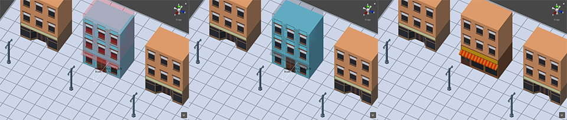
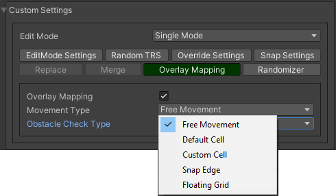

.. _tabs:

********************
Common tabs overview
********************

.. contents::
   :local:
   
EditMode settings
=================
   
**There are the following modes:**
	* Single mode
	* Brush mode
	* Line mode
	* Area mode
	* Destroy mode
	* Tileset area
	* Translate mode
	* Create template mode
	
Each mode contains unique settings, that described in more detail here :ref:`modes`.

Random TRS
==========

``Random TRS tab is used for randomization position, rotation or scale of the object.``

**Main randomize tab displays which random is enabled**

.. image:: images/tabs/RandomTab/RandomTab1.png

* Choose which angle and axis of rotation to randomize.
	.. image:: images/tabs/RandomTab/RandomTab2.png
	
* Enter randomize local position relative spawn position.
	.. image:: images/tabs/RandomTab/RandomTab3.png

* Enter value and axis of scale to randomize.
	.. image:: images/tabs/RandomTab/RandomTab4.png

Override settings
=================

``In the override settings tab you can override parent object, MapTile layer for non-overlay objects, and override unity layer.``

	.. image:: images/tabs/OverrideTab/OverrideTab1.png

	* **Override object parent** : a custom parent for the override.
	* **Override MapTile layer** : a custom `MapTile` layer for `MapTile` objects.
	* **Override Unity layer** : a custom Unity layer for the objects (Default, TransparentFX, Ignore Raycast, Water, UI, etc...).

	.. image:: images/tabs/OverrideTab/OverrideTab2.png

	.. note::
		For overlay `MapTile` objects or default game objects (without `MapTile` component) you can't override `MapTile` layer.

Snap settings
=============

``In snap settings you can adjust the Y-axis object snap settings.``

.. image:: images/tabs/SnapTab/SnapTab1.png

**Object snap type:**
	* **Auto snap** : objects are automatically attached to the surface depending on the parameters.

		.. image:: images/tabs/SnapTab/SnapTab2.png

		* **Attach to mesh** : the object is attached to the mesh, instead of the collider.
		* **Attach same floor** : to auto-snap objects on the same height use the attach same floor.
			
			.. image:: images/tabs/SnapTab/SnapTab3.png		
				:width: 49 %			
			
			.. image:: images/tabs/SnapTab/SnapTab4.png
				:width: 49 %				
			`Attach same floor example.`
					
		.. note::
			Only works for area and line modes.

		
		* **Snap layer mask** : layer that the object is automatically attached.
		* **Custom floor offset** : additional offset to the surface.
		* **Add pivot offset** : adds a pivot offset of the object regarding to the surface.
		
		.. image:: images/tabs/SnapTab/SnapTab5.png		
		Some tile objects may have a pivot in the center of the object.
	
		|	
		.. image:: images/tabs/SnapTab/SnapTab6.png		
		To fix this, turn on add pivot offset

	* **Custom** : customization value of the position on the Y axis.

		.. image:: images/tabs/SnapTab/SnapTab7.png

		* **Fixed zero position** : object is always positioned at Y zero position.
		* **Prefab position** : object Y position is taken from the prefab position.
		* **Custom position** : set desired Y position of the object.
		
		|
		.. image:: images/tabs/SnapTab/SnapTab8.png
		`Custom local offset (0, 4, 0) example.`

Replace
=======

``Replace is used to replace intersected objects.``

The object cannot be placed.

.. image:: images/tabs/ReplaceTab/ReplaceTab2.png

Enable replace to replace intersected objects.

	* Replace layer type
	
		.. image:: images/tabs/ReplaceTab/ReplaceTab4.png
	
		* **Object layer** : replace objects only on the same object layer.
		
		.. image:: images/tabs/ReplaceTab/ReplaceTab5.png
		
		* **Custom layers**
			* **Replace map tile layer** : replace objects only on the selected layers.
			* **Include object layer**

Merge
=====

``Merge is used to create object by a child to an existing one.``

	.. image:: images/tabs/MergeTab/MergeTab1.png

	.. image:: images/tabs/MergeTab/MergeTab2.png
	
	* **Merge object prefab mode:**
		* **Linked prefab** : the created object is a linked prefab.
		* **Prefab clone** : the created object is a prefab clone.
		
	.. image:: images/tabs/MergeTab/MergeTab3.png
	
	* **Merge parent type:**
		* **Target object prefab root** : the created object is created by a child to the prefab root.		
		* **Target object parent of hit** : the created object is created by a child to the attached object.
		* **Custom parent**	: user selected custom parent.
		* **Relative prefab root path** : the created object is created by a child to the prefab root regarding to prefab root path.
	* **Delete components** : delete all unity-components of the object.
			* Delete only map tile 
				or only MapTile component.
			
	* **Delete colliders** : delete colliders of created object.
	
	.. image:: images/tabs/MergeTab/MergeTab4.png
	For example, use the brush to attach the object to desired object.

	|
	.. image:: images/tabs/MergeTab/MergeTab5.png
	And create it

Overlay mapping
===============
 
``Overlay mapping is used for objects that do not need to calculate intersections with other objects on the grid, also used to set a custom grid or disable snapping to the grid.``
 
.. image:: images/tabs/OverlayTab/OverlayTab1.png

You can enable it for `MapTile` layer 1-9 (for overlay layer objects and default gameobjects (without `MapTile` component) enabled by default).

.. image:: images/tabs/OverlayTab/OverlayTab2.png

	.. note::
		For overlay `MapTile` objects and `non-MapTile` object overlay mapping enabled by default.

**Movement type:**
	* **Free moving** :	object attached to cursor.	
	* **Default cell** : object snapping to default cell size.
	* **Custom cell** : object snapping to custom cell size.
	
		.. image:: images/tabs/OverlayTab/OverlayTab4.png
		`Custom cell snapping example (custom cell size is equal 4.)` 
	|
	
	* **Snap edge** : object snapping to edges of default cell.
	
	|
	
		.. image:: images/tabs/OverlayTab/OverlayTab5.png		
		`Snap edge example 1.` 
		
		.. image:: images/tabs/OverlayTab/OverlayTab6.png
		`Snap edge example 2.` 
	|
	
	.. image:: images/tabs/OverlayTab/OverlayTab7.png
	
**Obstacle check type:**
	* **Distance** : object intersections are checked by distance (works only for `MapTile` overlay grid objects).
	
		|
		
		.. image:: images/tabs/OverlayTab/OverlayTabObstacleExample2.png
		`Obstacle distance check example.` 
		
		|
		
	* **Raycast** : object intersections are checked by raycasts (works only for any gameobject with colliders).
	
		|
		
		.. image:: images/tabs/OverlayTab/OverlayTabObstacleExample1.png
		`Obstacle raycast check example.` 

Randomizer
==========

``Enable randomize objects to randomize every object creation.``

	.. image:: images/tabs/RandomizerTab/RandomizerTab1.png

	* **Randomize any category object** : any object of selected category involved in randomization.

	.. image:: images/tabs/RandomizerTab/RandomizerTab2.png
	
	.. image:: images/tabs/RandomizerTab/RandomizerExample1.png
	`Object randomization example (by default by pressing the space bar button).` 

Or select custom objects to randomize.
	
	.. image:: images/tabs/RandomizerTab/RandomizerTab3.png
	Enter random pattern according to the indices of the selected objects.

	|
	.. image:: images/tabs/RandomizerTab/RandomizerTab4.png	
	And place the objects according to the pattern.